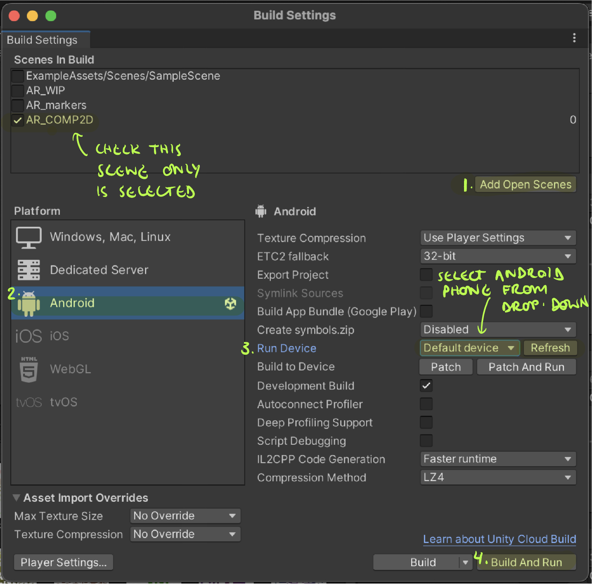
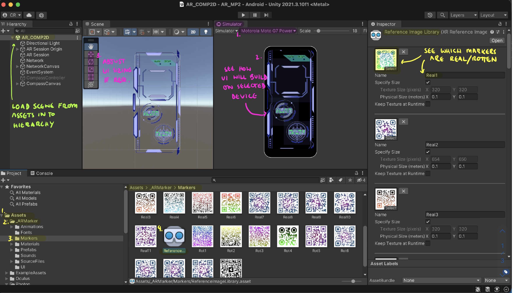

# Marco Predatoro: Polo datapad (AR phone) Setup

### Project Description

This repo contains code and packages required for the ARphone app in Marco Predatoro's Polo gameplay. It has been built using Unity 2021.3.10f1, and various packages that can be found in the *Packages* folder. 

### Installation and Setup

In order to build and run this project, Unity should be installed on your device: this can be found on the Unity website.
1. Although Unity's ARFoundation should work with *Unity 2020.3 or later*, for optimum compatibility download *Unity 2021.3.10f1* from the Unity Hub.
2. To build the application for Android phones, add the *Android Build Support* module to your Unity version in the Unity Hub. See [Unity's Documentation](https://docs.unity3d.com/Manual/android-sdksetup.html) for further details.
3. Download the project by cloning this repository or downloading ZIP. 
The required packages should be installed via Unity's Package Manager:
* Photon PUN2
* AR (Unity Feature: includes 6 AR related Unity packages)
* Oculus XR Integration
4. Open the project in your Unity version

### Usage
In order to build the application to an Android phone:
1. Load the **AR_COMP2D** scene into Unity, found in the *Assets* folder
2. Connect Android phone to your device, and ensure it is set up for development (see [Android's documentation](https://developer.android.com/studio/debug/dev-options) for more information).
3. Use Simulator Unity window to preview UI on your chosen device. Use Scene view to re-adjust sizing if required
4. Build the project for Android (File > Build Settings > Click add open scenes > Platform: Android > Run device > Build and Run)

5. The game should automatically Run on your Android phone when build is finished
6. Press the red Marco Predatoro logo in the top left to join the network and play the game!

A key element of the Application is the AR marker tracking system. 
1. Print **markers.pdf**, from *Assets* folder
2. Look in Unity project to see which markers correspond to 'Real' vs 'Rotten' eggs. (Assets > \_ARmarker > Marker > Reference Image Library)
3. If full game is being built:
* Attach markers to plastic eggs
* Attach RFID tags to each egg
* Update Dictionaries in *NewBodyTracking* project;s **RFID.cs** script. The RFIDs can be scanned via a USB RFID scanner, and the values for marker keys 'Real1' 'Real2' etc should be updated to their corresponding RFID code.

### Legacy versions of project
Users can build and run older features of the game in 2 ways. Note these were experimental features which varying levels of completion and playability:
1. AR Marco model: Load in **AR_WIP** Scene in the Unity Editor
2. AR Compass: Download repo from commit ['Beep and Compass working on build'](https://github.com/MarcoPredatoro/AR-Project/tree/6e9d1e4af4920414a6c7f632e54dd503eeef041d) and open **AR_COMP2D** scene in Unity
3. AR Border compass: Download repo from commit ['Compass Edge and power-ups(bug on power-up)'](https://github.com/MarcoPredatoro/AR-Project/tree/b003f1929ae22184367945ad2293a41714d73c50) and open **AR_COMP2D** scene in Unity
 
### Contributing
If you'd like to add functionality to Polo's datapad app, please follow these steps:

1. Fork the repository.
2. Create a new branch for your changes.
3. Make your changes and commit them to your branch.
4. Submit a pull request to merge your changes into the main branch.
5. Please ensure that your contributions are well-documented and adhere to any relevant coding standards or conventions.

### Credits
This project was built as part of a University of Bristol Year 3 CS Games Project, Marco Predatoro, using Unity's AR starter project and the ARFoundation package. Thanks to Unity and the University of Bristol for their support, which was invaluable in making this project a reality.

